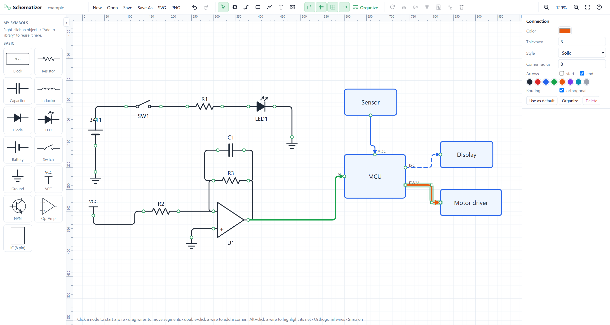

# Schematizer

A browser app for block diagrams and simple circuit schematics on a grid canvas.



## Run

Double-click **`Start Schematizer.bat`**, or run:

```bash
npm install
npm run dev
```

Then open http://localhost:5173.

Your drawing is autosaved in the browser. **Save** (Ctrl+S) writes a `.schematizer.json` project file: the first time it asks where to save, and later saves overwrite that same file. This also applies to a file you opened. **Save As** (Ctrl+Shift+S) saves to a new file. An orange dot next to the file name means there are unsaved changes. Use **SVG** / **PNG** to export images.

> Overwriting files needs Chrome or Edge. In other browsers, Save downloads a new copy each time.

## How to use

| Do this | How |
|---|---|
| Add an image | Toolbar image button (I), drag a file onto the canvas, or paste an image (Ctrl+V) |
| Add a part | Click or drag a symbol from the left library |
| Add nodes (connection points) | Node tool (N), then click on an object. Nodes snap to the object's edges |
| Rename an object, node or text | Double-click it, or use the right-hand panel |
| Connect two nodes | Click a node, then click the other node. With no corners placed, the wire is auto-routed |
| Add corners while drawing a wire | Click on empty canvas. Backspace removes the last corner, Esc cancels |
| Connect to an existing wire | While drawing a wire, click on another wire. A junction dot is created |
| Free wire end | Double-click on empty canvas while drawing a wire |
| Add a corner to a wire | Double-click the wire, then drag the corner |
| Move a wire segment or corner | Select the wire, then drag the segment or the square handle |
| Organize wires | **Organize** button. Re-routes the selected wires (or all wires, if nothing is selected) to avoid objects, labels and crossings |
| Orthogonal lock | Toolbar button or O. When on, wires use only horizontal and vertical segments |
| Node style | Select a node to set its outer/inner color and radius (inner radius 0 = solid dot), and whether it shows in exports. Apply it to all nodes of the object, or make it the default for new nodes |
| Wire style | Select a wire to set color, thickness, dash style, corner radius and arrows. "Use as default" applies that style to new wires |
| Copy / paste with connections | Ctrl+C / Ctrl+V pastes at the mouse. Wires between copied objects are copied too |
| Build your own part | Box (B), Line (L) and Text (T) tools, then select the pieces → Ctrl+G to group, add nodes, right-click → *Add to library* |
| Net labels | Nodes with the same net label (e.g. `GND`) count as connected without a wire. Alt+click a wire highlights its whole net |

Press **?** in the app to see all keyboard shortcuts.
